# 🏗 Keystone — Trustless Escrow Infrastructure

[](https://nextjs.org/)
[](https://www.typescriptlang.org/)
[](https://stellar.org)
[](https://www.rust-lang.org/)
[](https://www.freighter.app/)
[](https://opensource.org/licenses/MIT)

**Trustless milestone escrow protocol built on the Stellar network.**

Clients lock transaction capital per milestone in secure smart contracts; freelancers receive payouts automatically upon mutual approval—eliminating manual invoicing delays, third-party custody risks, and fee exploitation. Features a neutral on-chain arbiter console to resolve disputes cleanly.

---

## 📌 Why Keystone?

- 🔒 **Trustless Milestone Escrow**: Funds are locked inside decentralized ledger states, never custodied by the platform.
- ⚡ **Native Soroban Smart Contracts**: Clean Rust implementation running on WASM runtime.
- 💰 **Cross-Contract Flow**: Automated 98/2% splits executing payouts across multi-hop contract actions.
- 🛡 **Neutral Arbitration**: designated Arbiter role resolves contested funds without user collision.
- 📱 **Mobile-First CAD design**: Optimized mobile navigation dock and form fields covering down to 320px screens.

---

## 🚀 Live Demo

- **Live Application**: `<FRONTEND_URL>`
- **Backend API**: `<BACKEND_URL>`
- **Demo Video (1-2 min)**: `<DEMO_VIDEO_LINK>`
- **Presentation Deck**: `<PRESENTATION_LINK>`

### Stellar Expert Testnet Contracts
- 📄 [Escrow Contract Explorer](https://stellar.expert/explorer/testnet/contract/CBZ472YIFAPH3MMP25AWKS53CVI3JVHSEJDOGBAWSPWJ6WFNNOMHL3VC)
- 🔀 [Fee Router Contract Explorer](https://stellar.expert/explorer/testnet/contract/CBYVRXSCGOIMIN746C77BYEV2QKNVP6RA4JC5TTHED4JX7C6SQQ6SZ47)
- 💸 [Payout Contract Explorer](https://stellar.expert/explorer/testnet/contract/CCD5UJQEE2K7M3CATACJ5QOUZTW6V2EX54QKNROIRD423HL6OKFX5ZHA)

Every on-chain action in the application links directly to Stellar Expert using this transaction pattern:
```
https://stellar.expert/explorer/testnet/tx/{transaction_hash}
```
*Example multi-hop payout transaction (Escrow ➔ Fee Router ➔ Payout ➔ Freelancer):*
```
https://stellar.expert/explorer/testnet/tx/756f329eac01ae2dde71936b1577365cf3cd595552356b8d4378938eb677cc8e
```

---

## 📖 Table of Contents

1. [⚡ Features](#-features)
2. [🛠 Tech Stack](#-tech-stack)
3. [🏗 System Architecture](#-system-architecture)
4. [🚦 Milestone Lifecycle](#-milestone-lifecycle)
5. [📦 Folder Structure](#-folder-structure)
6. [📖 Smart Contracts](#-smart-contracts)
7. [⚙ Installation](#-installation)
8. [🧪 Testing](#-testing)
9. [🚀 Deployment](#-deployment)
10. [🔒 Security & Permission Model](#-security--permission-model)
11. [⚠️ Known Limitations](#-known-limitations)
12. [🔮 Future Improvements](#-future-improvements)
13. [📄 License](#-license)

---

## ⚡ Features

- **Freighter Wallet Connect / Disconnect**: Programmatic connection, network check overrides, and installation detection.
- **Multi-Milestone Job Creation**: Clients draft complex jobs specifying distinct milestones, titles, descriptions, and budgets.
- **Deferred Milestone Funding**: Retain capital flexibility. Clients fund each milestone individually on-demand rather than locking 100% of project costs upfront.
- **Auto-Routing Payments Split**: Decentralized, permissionless 98% / 2% split executing Payout transfers.
- **Neutral On-Chain Arbitration**: Exclusive, role-gated Arbiter controls to release or refund disputed milestone balances.
- **Secure Off-Chain Metadata Store**: Job titles and descriptions are aggregated via Express/Supabase and verified via cryptographic signature checks.
- **Pulsing Loading State Skeletons**: Modern pulsing templates mock loader states during RPC simulations, avoiding shifts in UI.
- **Responsive Layout System**: Spacing, clamp headings, and navigation dock adapt from 320px mobile viewports up to large desktop widths.

---

## 🛠 Tech Stack

| Layer | Technology | Purpose |
|---|---|---|
| **Frontend** | React, Next.js (App Router), TS | Modular views, responsive dashboards, and CAD styles. |
| **Styling** | Tailwind CSS, Vanilla CSS | Core tokens, responsive utilities, and custom scroll elements. |
| **Wallets** | Freighter API | Signature actions, wallet connect, and validation checks. |
| **Blockchain** | Stellar SDK, Soroban RPC | Contract simulations, dynamic logs, and exponential backoff retry. |
| **Contracts** | Rust, Soroban SDK | WASM compilation, TTL bounds checking, and test fixtures. |
| **Backend API** | Node.js, Express, TS | Metadata routing, CORS preflights, and signature verification. |
| **Database** | Supabase (PostgreSQL) | Cryptographically indexed job metadata search storage. |
| **Deployment**| Vercel & Render | Continuous integration pipeline for frontend and backend API. |

---

## 🏗 System Architecture

The Keystone protocol separates duties across three distinct smart contracts to maximize isolation and prevent custody conflicts. All incoming funds flow from the client into the core Escrow contract, which triggers subsequent routing transactions.

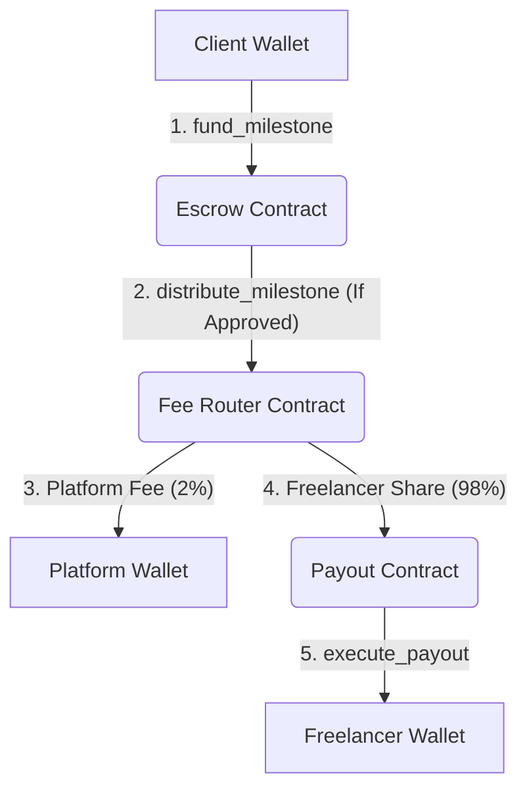

---

## 🚦 Milestone Lifecycle

Each milestone tracks progress in a state-machine that spans active progress, approval, and alternative arbitration resolution pathways.

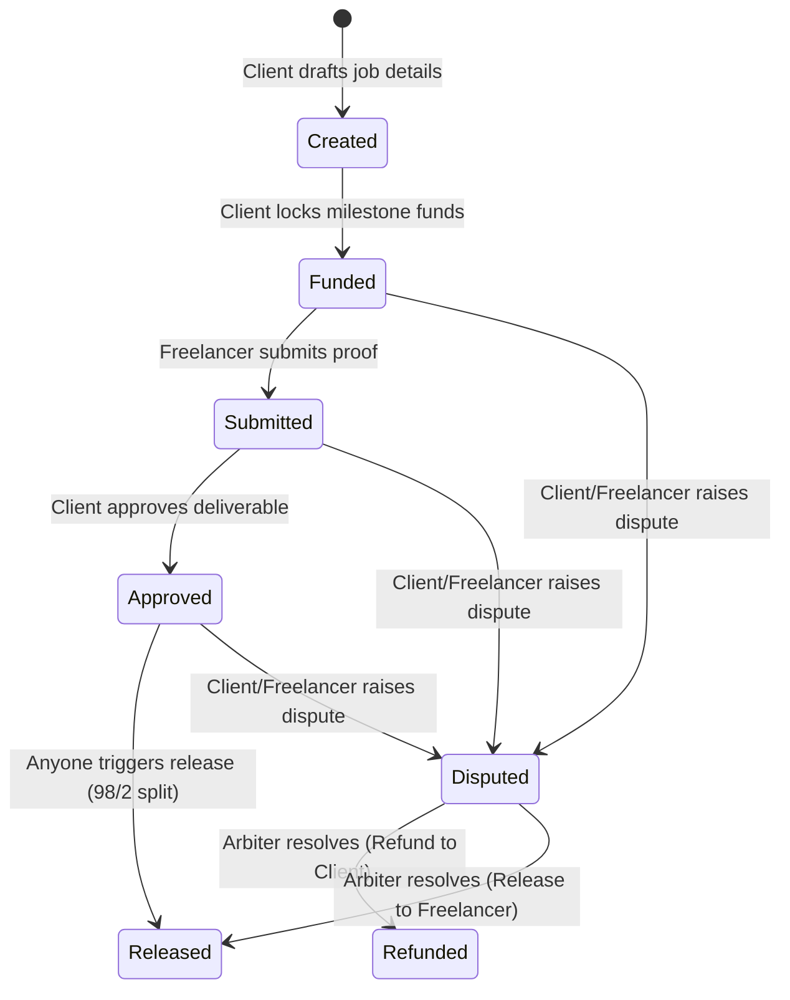

---

## 📸 Screenshots

#### 💻 Desktop Dashboard view
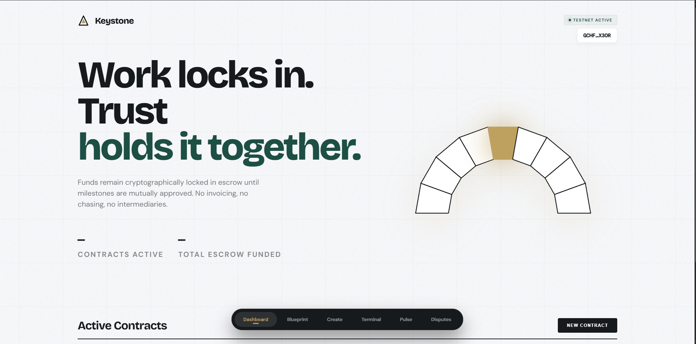

#### 📱 Mobile Dashboard view
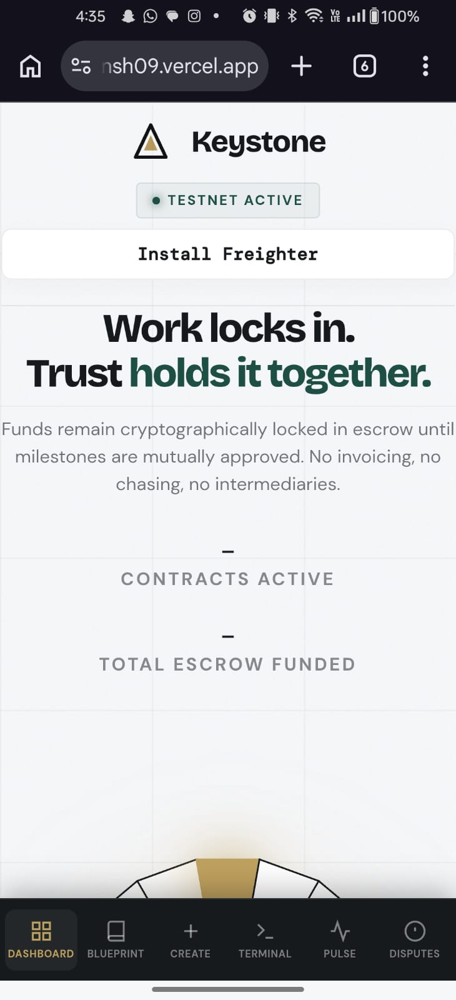

#### ➕ Create Agreement Flow
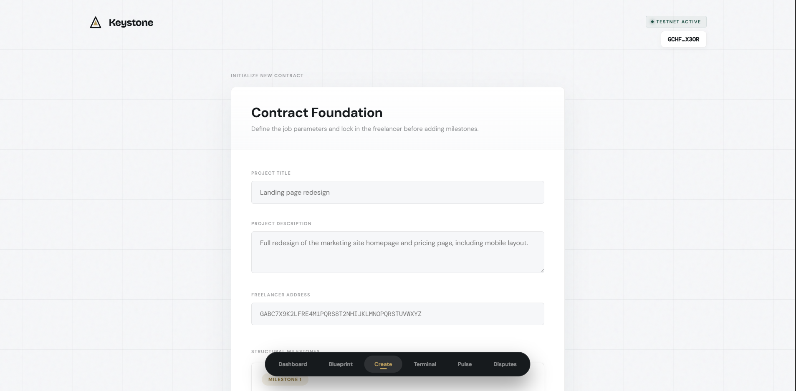

#### 🔍 Explorer Search page
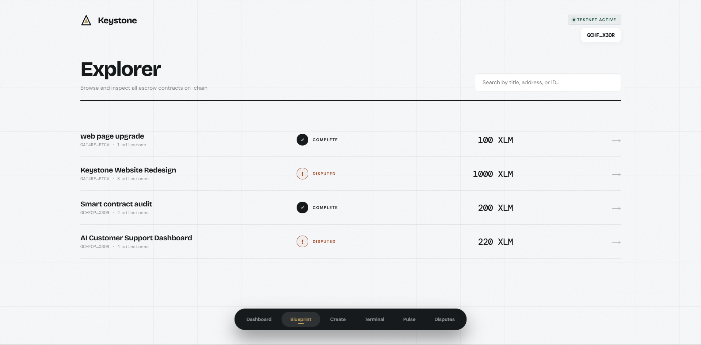

#### ⚖️ Disputes Resolution console
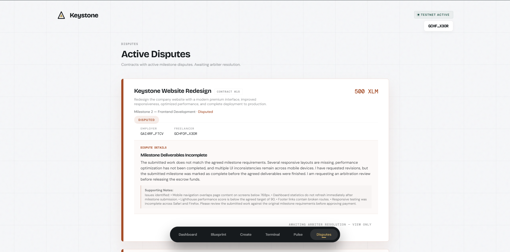

#### 🔄 CI/CD pipeline
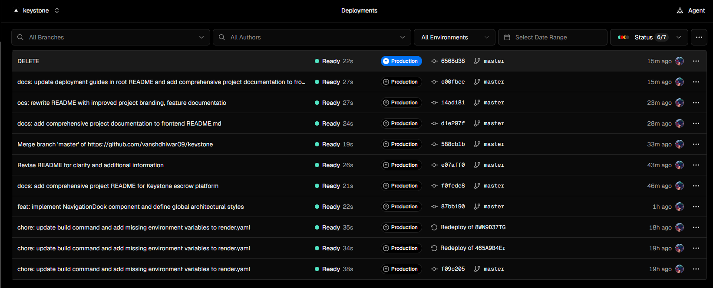

#### 🧪 Test output
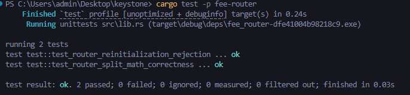
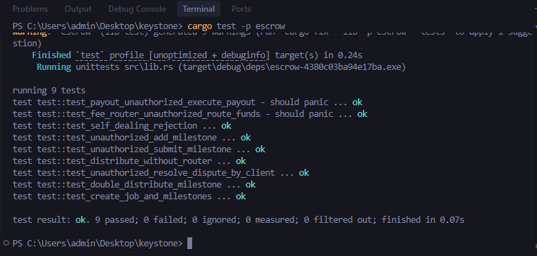
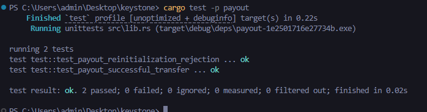

---

## 📦 Folder Structure

The repository is structured as a monorepo containing contracts, backend logic, and the web app:

```
keystone/
├── contracts/          # Smart contract workspace
│   ├── escrow/          # Core state-machine, milestone rules, and disputes
│   ├── fee-router/      # Platforms fee router splitter (98/2 fee splits)
│   └── payout/          # Destination payout router to freelancer addresses
├── frontend/           # Next.js web application
│   ├── src/app/         # App router wrapper, globals, and navigation views
│   ├── src/components/  # Layout panels (Dashboard, Explorer, Disputes, Creator forms)
│   ├── src/context/     # Reactive contexts ( Freighter wallet status, toast notifications)
│   └── src/lib/         # Soroban contract connectors, api metadata requests
├── backend/            # Express metadata microservice
│   ├── src/index.ts     # Express server doing signature auth checks and health metrics
│   └── .env.example
├── scripts/            # Script folder
│   └── deploy.ps1       # Automated Testnet network contract compilation script
└── docs/               # Visual verification assets
    └── screenshots/     # Mobile responsive visual captures
```

---

## 📖 Smart Contracts

Each contract component is architected independently to manage distinct rules within the system model:

### 1. Escrow
*Designated entry-point contract managing milestones.*

| Function | Calling Authority | Operational Objective |
|---|---|---|
| `initialize` | Contract Deployer | Configures target arbiter and trusted `FeeRouter` addresses. |
| `create_job` | Connected Client | Registers a unique job matching client and freelancer address. |
| `add_milestone` | Connected Client | Inserts a milestone specifying the target reward amount. |
| `fund_milestone` | Connected Client | Transfers payment tokens into contract custody. |
| `submit_milestone` | Assigned Freelancer | Updates state flag to `Submitted` requesting review. |
| `approve_milestone` | Connected Client | Verifies completed deliverables, transitioning state to `Approved`. |
| `raise_dispute` | Client or Freelancer | Halts operations and locks milestone state to `Disputed`. |
| `resolve_dispute` | Designated Arbiter | Grants resolution releasing funds to freelancer or client. |
| `distribute_milestone` | Permissionless (Anyone) | Moves approved milestone funds forward into the `FeeRouter`. |

### 2. FeeRouter
*Auto-split processor.*

| Function | Calling Authority | Operational Objective |
|---|---|---|
| `init_fee_router` | Contract Deployer | Sets Platform fee wallet, Payout contract, and Escrow addresses. |
| `route_funds` | Escrow Contract Only | Deducts 2% for platform wallet and forwards 98% to Payout. |

### 3. Payout
*Endpoint execution contract.*

| Function | Calling Authority | Operational Objective |
|---|---|---|
| `init_payout` | Contract Deployer | Confirms validation mapping of target `FeeRouter` router address. |
| `execute_payout` | Fee Router Contract Only | Discharges final 98% payout amount directly to the freelancer. |

---

## ⚙ Installation

### Prerequisites
- Node.js `v20.x` or higher (compatible with Node 22).
- Rust `v1.84.0+` with the `wasm32v1-none` compiler target installed.
- Stellar CLI installed locally.
- Freighter browser wallet extension with Testnet enabled.

```bash
rustup target add wasm32v1-none
```

### Installation Steps

1. Clone the repository and configure dependencies:
   ```bash
   git clone <REPOSITORY_URL>
   cd keystone
   ```

2. Configure Frontend Environment:
   ```bash
   cd frontend
   npm install
   cp .env.example .env.local
   ```
   *Edit `.env.local` to match your local addresses.*

3. Configure Backend Environment:
   ```bash
   cd ../backend
   npm install
   cp .env.example .env
   ```
   *Set your Supabase database parameters and CORS origins.*

### Environment Configurations

#### Frontend (`frontend/.env.local`)
| Key | Required | Value / Details |
|---|---|---|
| `NEXT_PUBLIC_ESCROW_ID` | Yes | Escrow contract hash address. |
| `NEXT_PUBLIC_FEE_ROUTER_ID` | Yes | Platform Fee Router contract hash address. |
| `NEXT_PUBLIC_PAYOUT_ID` | Yes | Freelancer Payout contract hash address. |
| `NEXT_PUBLIC_TOKEN_ID` | Yes | Token address for payment assets (Wrapped XLM). |
| `NEXT_PUBLIC_ARBITER_ID` | Yes | Public key address of the designated Arbiter account. |
| `NEXT_PUBLIC_NETWORK` | No | `testnet` |
| `NEXT_PUBLIC_RPC_URL` | No | Target Soroban RPC Endpoint provider. |
| `NEXT_PUBLIC_BACKEND_URL` | Yes | Base URL endpoint for the metadata app. |

#### Backend (`backend/.env`)
| Key | Required | Value / Details |
|---|---|---|
| `PORT` | No | Server port (default `4000`). |
| `SUPABASE_URL` | Yes | Your Supabase project URL |
| `SUPABASE_SERVICE_ROLE_KEY` | Yes | Supabase service role key (keep secure, never leak to frontend). |
| `ESCROW_CONTRACT_ID` | Yes | Must match `NEXT_PUBLIC_ESCROW_ID` in Next.js exactly. |

---

## 🧪 Testing

Core contract rules are verified by automated unit tests validating state limits, auth restrictions, and transaction splits.

### Smart Contracts Testing
The workspace contains 13 unit tests verifying state transitions, limits, and cross-contract splits.
```bash
# Inside the root repository
cd contracts
cargo test --workspace
```

For WASM build outputs:
```bash
stellar contract build
```

### Running Locally
Start dev environments for backend and frontend apps in separate terminals:

```bash
# Terminal 1: Backend metadata service
cd backend
npm run dev

# Terminal 2: Web frontend
cd frontend
npm run dev
```

---

## 🚀 Deployment

### Frontend (Vercel)
- **Production URL**: `https://keystone-escrow.vercel.app`
- **Framework Preset**: Next.js (inside `/frontend` directory)
- **Install & Build Settings**: 
  - Build Command: `npm run build`
  - Install Command: `npm install`
- **Environment Variables (Production + Preview)**:
  Set these variables in your Vercel project configuration console:
  ```env
  NEXT_PUBLIC_ESCROW_ID=CBZ472YIFAPH3MMP25AWKS53CVI3JVHSEJDOGBAWSPWJ6WFNNOMHL3VC
  NEXT_PUBLIC_FEE_ROUTER_ID=CBYVRXSCGOIMIN746C77BYEV2QKNVP6RA4JC5TTHED4JX7C6SQQ6SZ47
  NEXT_PUBLIC_PAYOUT_ID=CCD5UJQEE2K7M3CATACJ5QOUZTW6V2EX54QKNROIRD423HL6OKFX5ZHA
  NEXT_PUBLIC_TOKEN_ID=CDLZFC3SYJYDZT7K67VZ75HPJVIEUVNIXF47ZG2FB2RMQQVU2HHGCYSC
  NEXT_PUBLIC_ARBITER_ID=GC66O7ANIHELSXEAJFF7ES7OMCSYQCMBJT4TESQTNSYJGF4KTP2XET2M
  NEXT_PUBLIC_NETWORK=testnet
  NEXT_PUBLIC_RPC_URL=https://soroban-testnet.stellar.org
  NEXT_PUBLIC_BACKEND_URL=https://keystone-backend.onrender.com
  ```
  *(Note: All `NEXT_PUBLIC_*` environment variables must be defined at project build time to be bundled into the compiled frontend app's bundle.)*

### Backend (Render / Railway)
- **Production URL**: `https://keystone-backend.onrender.com`
- **Runtime Environment**: Node.js 20+
- **Build & Application Settings**:
  - Build Command: `cd backend && npm install && npm run build`
  - Start Command: `node backend/dist/index.js`
- **Environment Variables**:
  Configure these environment variables in your server provider console:
  ```env
  PORT=4000
  SUPABASE_URL=https://your-project.supabase.co
  SUPABASE_SERVICE_ROLE_KEY=your-supabase-service-key
  RPC_URL=https://soroban-testnet.stellar.org
  NETWORK_PASSPHRASE=Testnet Global Stellar Network ; October 2025
  ESCROW_CONTRACT_ID=CBZ472YIFAPH3MMP25AWKS53CVI3JVHSEJDOGBAWSPWJ6WFNNOMHL3VC
  FRONTEND_URL=https://keystone-escrow.vercel.app
  ```
  *(Note: The `FRONTEND_URL` is parsed by the Express server dynamically to apply secure CORS preflight headers allowing origin connections.)*

### Contracts (Stellar Testnet)
Contract hashes are pre-deployed at the addresses documented above. To rebuild and deploy fresh contract codes:
1. Re-compile targeting wasm runtime:
   ```bash
   cd contracts
   stellar contract build
   ```
2. Execute the pre-configured deployment flow:
   ```bash
   cd ../scripts
   ./deploy.ps1
   ```
3. Update both `frontend/.env.local` and `backend/.env` with the new output contract ID hashes.


---

## 🔒 Security & Permission Model

Keystone enforces strict permission isolation directly on ledger levels:
- **`require_auth()` Checks**: Escrow validation verifies that clients cannot fund/approve milestones using other addresses, and freelancers can only mark progress for milestones assigned to them.
- **Autonomous Payout Access**: Payout contracts only execute requests that provide validated sign-offs from the Fee Router.
- **Metadata Protection**: Supabase updates are validated on the backend by confirming that requested changes match signatures generated by actual on-chain contract owners.

---

---

## 🔮 Future Improvements

- [ ] Implement an on-chain ledger event indexer to replace the Supabase metadata query engine.
- [ ] Incorporate structured encrypted dispute logs and messaging within the arbitrator panel.
- [ ] Connect Stellar Wallets Kit to support Albedo, xBull, and alternative wallet connectors.
- [ ] Mainnet network support configuration guide.
- [ ] Configurable platform fee percentage.
- [ ] Notification system for milestone status changes.

---

## 📄 License

Distributed under the MIT License. See `LICENSE` for more information.
