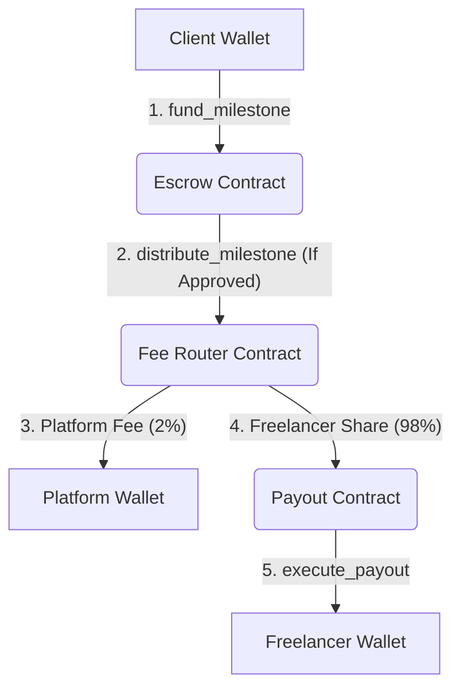
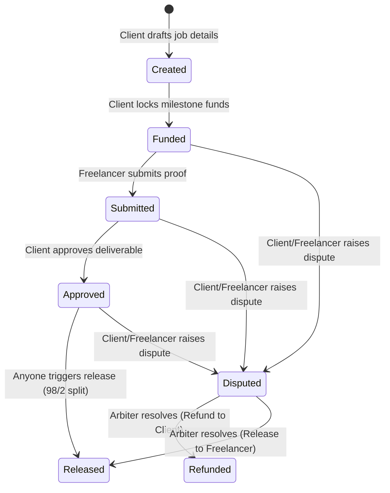

# 🏗 Keystone — Trustless Escrow Infrastructure

[](https://stellar.org)
[](https://www.freighter.app/)
[](https://opensource.org/licenses/MIT)

Trustless multi-milestone escrow protocol built on Stellar. Clients lock transaction capital per milestone in secure smart contracts; freelancers receive payouts automatically upon mutual approval—eliminating manual invoicing delays, third-party custody risks, and fee exploitation. Features a neutral on-chain arbiter console to resolve disputes cleanly.

---

## 📸 Screenshots

> [!NOTE]
> *Replace placeholders below with absolute production path assets once visual layouts are captured.*

| **Dashboard (Mobile)** | **Contract Details (Mobile)** | **Create Job Flow (Mobile)** |
|---|---|---|
|  |  |  |

---

## 📖 Table of Contents

- [⚡ Features](#-features)
- [🛠 Technical Stack](#-technical-stack)
- [🏗 System Architecture](#-system-architecture)
- [🚦 Milestone Lifecycle](#-milestone-lifecycle)
- [📦 Directory Structure](#-directory-structure)
- [📖 Smart Contract Framework](#-smart-contract-framework)
- [⚙ Installation & Configuration](#-installation--configuration)
- [🧪 Testing Suites](#-testing-suites)
- [🚀 End-to-End Walkthrough](#-end-to-end-walkthrough)
- [🔒 Security & Permission Model](#-security--permission-model)
- [⚠️ Limitations & Roadmap](#-limitations--roadmap)

---

## ⚡ Features

- **Freighter Wallet Authentication**: Complete connect, disconnect, and ledger network state synchronization bounds.
- **Dynamic Multi-Milestone Construction**: Clients author complex agreements with custom milestone durations, descriptions, and budgets in a single workflow.
- **Deferred Milestone Funding**: Retain capital flexibility. Clients fund each milestone individually on-demand rather than locking 100% of project costs upfront.
- **Auto-Routing Platform Split**: Decentralized, permissionless 98/2% payout architecture split between the freelancer and platform.
- **Neutral On-Chain Arbitrator Console**: Role-gated dispute resolution panel giving the designated arbiter exclusive powers to release or refund disputed escrowed assets.
- **Secure Off-Chain Metadata Store**: Job titles and descriptions are aggregated via Express/Supabase, protected by cryptographic signature checks that prevent cross-job spoofing.
- **Pulsing Loading State Skeletons**: Modern pulsing card templates that eliminate layout shifts during on-chain RPC checks.
- **Responsive Spacing System**: Built from the ground up to support viewports from 320px wide up to flat screens.

---

## 🛠 Technical Stack

| Layer | Component | Description |
|---|---|---|
| **Frontend** | React / Next.js (App Router), TypeScript, Tailwind CSS | Modular views, reactive layouts, and CAD style sheets. |
| **Wallets** | Freighter API | Cryptographic transaction signing and account sync. |
| **Blockchain** | Stellar SDK, Soroban RPC | RPC simulation, client-side caching, and exponential backoff retry. |
| **Smart Contracts** | Rust, Soroban SDK | WASM compilations with strict TTL bounds and unit test harnesses. |
| **Backend API** | Node.js / Express, TypeScript | Metadata ingestion, cors protection, and signature checks. |
| **Database** | Supabase (PostgreSQL) | Indexed records of off-chain contract definitions. |

---

## 🏗 System Architecture

The Keystone protocol separates duties across three distinct smart contracts to maximize isolation and prevent custody conflicts. All incoming funds flow from the client into the core Escrow contract, which triggers subsequent routing transactions.



---

## 🚦 Milestone Lifecycle

Each milestone tracks progress in a state-machine that spans active progress, approval, and alternative arbitration resolution pathways.



---

## 📦 Directory Structure

```
keystone/
├── contracts/
│   ├── escrow/          # Core state-machine, milestone rules, and dispute resolution
│   ├── fee-router/      # Platforms fee router splitter (98/2 fee splits)
│   └── payout/          # Destination payout router to freelancer addresses
├── frontend/
│   ├── src/app/         # App router wrapper, globals, and navigation views
│   ├── src/components/  # Layout panels (Dashboard, Explorer, Disputes, Creator forms)
│   ├── src/context/     # Reactive contexts ( Freighters wallet status, toast notification limits)
│   └── src/lib/         # Soroban contract connectors, api metadata requests
├── backend/
│   ├── src/index.ts     # Express server doing signature auth checks and health metrics
│   └── .env.example
├── scripts/
│   └── deploy.ps1       # Automated Testnet network contract compilation script
└── docs/
    └── screenshots/     # Mobile responsive visual captures
```

---

## 📖 Smart Contract Framework

### `Escrow`
*Designated entry-point contract managing milestones.*

| Function | Calling Authority | Operational Objective |
|---|---|---|
| `initialize` | Contract Deployer | Configures target arbiter and trusted `FeeRouter` addresses. |
| `create_job` | Connected Client | registers a unique job matching client and freelancer address. |
| `add_milestone` | Connected Client | Inserts a milestone specifying the target reward amount. |
| `fund_milestone` | Connected Client | Transfers payment tokens into contract custody. |
| `submit_milestone` | Assigned Freelancer | Updates state flag to `Submitted` requesting review. |
| `approve_milestone` | Connected Client | Verifies completed deliverables, transitioning state to `Approved`. |
| `raise_dispute` | Client or Freelancer | Halts operations and locks milestone state to `Disputed`. |
| `resolve_dispute` | Designated Arbiter | Grants resolution releasing funds to freelancer or client. |
| `distribute_milestone` | Permissionless (Anyone) | Moves approved milestone funds forward into the `FeeRouter`. |

### `FeeRouter`
*Auto-split processor.*

| Function | Calling Authority | Operational Objective |
|---|---|---|
| `init_fee_router` | Contract Deployer | Sets Platform fee wallet, Payout contract, and Escrow addresses. |
| `route_funds` | Escrow Contract Only | Deducts 2% for platform wallet and forwards 98% to Payout. |

### `Payout`
*Endpoint execution contract.*

| Function | Calling Authority | Operational Objective |
|---|---|---|
| `init_payout` | Contract Deployer | Confirms validation mapping of target `FeeRouter` router address. |
| `execute_payout` | Fee Router Contract Only | Discharges final 98% payout amount directly to the freelancer. |

---

## ⚙ Installation & Configuration

### Prerequisites
- Node.js `v20.x` or higher
- Rust `v1.84.0+` with the `wasm32v1-none` compiler target installed:
  ```bash
  rustup target add wasm32v1-none
  ```
- Stellar CLI installed locally.
- Freighter browser wallet extension with Testnet enabled.

### Setup and Directory Installation
1. Clone the repository and configure dependencies:
   ```bash
   git clone <REPOSITORY_URL>
   cd keystone
   ```

2. Frontend configuration:
   ```bash
   cd frontend
   npm install
   cp .env.example .env.local
   ```
   *Edit `.env.local` to match your local addresses.*

3. Backend metadata server configuration:
   ```bash
   cd ../backend
   npm install
   cp .env.example .env
   ```
   *Set your Supabase database parameters and CORS origins.*

### Environment Variables Matrix

#### Frontend (`frontend/.env.local`)
| Key | Required | Value / Details |
|---|---|---|
| `NEXT_PUBLIC_ESCROW_ID` | Yes | Escrow contract hash address. |
| `NEXT_PUBLIC_ROUTER_ID` | Yes | Platform Fee Router contract hash address. |
| `NEXT_PUBLIC_PAYOUT_ID` | Yes | Freelancer Payout contract hash address. |
| `NEXT_PUBLIC_TOKEN_ID` | Yes | Token address for payment assets (Wrapped XLM). |
| `NEXT_PUBLIC_ARBITER_ID` | Yes | Public key address of the designated Arbiter account. |
| `NEXT_PUBLIC_NETWORK` | No | `testnet` |
| `NEXT_PUBLIC_RPC_URL` | No | Target Soroban RPC Endpoint provider. |
| `NEXT_PUBLIC_BACKEND_URL` | Yes | Base URL endpoint for the metadata app. |

#### Backend (`backend/.env`)
| Key | Required | Value / Details |
|---|---|---|
| `PORT` | No | Server port (default `4000`). |
| `SUPABASE_URL` | Yes | Database project connection credentials. |
| `SUPABASE_SERVICE_ROLE_KEY` | Yes | Service API role key (keep secure, never leak to frontend). |
| `ESCROW_CONTRACT_ID` | Yes | Must match `NEXT_PUBLIC_ESCROW_ID` in Next.js exactly. |

---

## 🧪 Testing Suites

Core contract rules are verified by automated unit tests validating state limits, auth restrictions, and transaction splits.

```bash
# Inside the root repository
cd contracts
cargo test --workspace
```

For WASM build outputs:
```bash
stellar contract build
```

---

## 🚀 Development & Local Execution

Start development servers for both modules in separate instances:

```bash
# Terminal 1: Backend metadata service
cd backend
npm run dev

# Terminal 2: Web frontend
cd frontend
npm run dev
```

The interface is exposed at `http://localhost:3000`.

---

## 🚀 End-to-End Walkthrough

Perform a full integration walkthrough on the Stellar Testnet:

1. **Configure Accounts**: Install Freighter, configure networks to Testnet, and fund three separate accounts (Client, Freelancer, and Arbiter) using Stellar's Friendbot.
2. **Deploy System**: Run scripts or manually deploy Escrow, Fee Router, and Payout contracts in order. Put the resulting keys in the environment files.
3. **Draft Agreement (Client)**: Connect Freighter. Create a Job specifying the Freelancer address, adding title details, and adding milestone budgets. Click Deploy.
4. **Funding and Progress (Client & Freelancer)**:
   - Client logs in, navigates to the Job page, and clicks **Fund Milestone** for the target step to lock token balances on-chain.
   - Switch wallet to the Freelancer. Deliver milestone results and click **Submit Milestone**.
   - Switch wallet to the Client. Review deliverables and click **Approve Milestone**.
5. **Release Funds**: Trigger **Distribute Funds**. Approved capital routes through the splitter, sending 2% platform fee to the platform owner and paying the remaining 98% directly to the freelancer.
6. **Arbitrate Disputes**:
   - If disputes arise, either party can click **Raise Dispute** to freeze resources.
   - Authorize the Arbiter account. The exclusive Arbiter panel exposes **Release** and **Refund** inputs to resolve the dispute.

---

## 🔒 Security & Permission Model

Keystone enforces strict permission isolation directly on ledger levels:
- **`require_auth()` Checks**: Escrow validation verifies that clients cannot fund/approve milestones using other addresses, and freelancers can only mark progress for milestones assigned to them.
- **Autonomous Payout Access**: Payout contracts only execute requests that provide validated sign-offs from the Fee Router.
- **Metadata Protection**: Supabase updates are validated on the backend by confirming that requested changes match signatures generated by actual on-chain contract owners.

---

## ⚠️ Limitations & Roadmap

- **No On-Chain Ingestion**: Currently scans off-chain metadata indexes via Supabase instead of direct event state rebuilds. *Roadmap: Implement Event Indexing.*
- **Unstructured Dispute Feedback**: Dispute details are coordinated off-site. *Roadmap: Add encrypted dispute notes storage options.*
- **Freighter Dependent**: Supported wallet is restricted to Freighter. *Roadmap: Wire Stellar Wallets Kit for Albedo / xBull support.*

---

## 📄 License

Distributed under the MIT License. See `LICENSE` for more information.